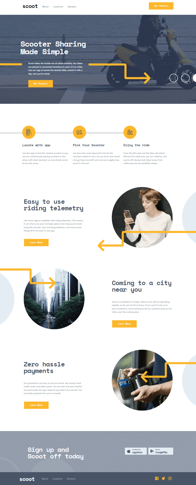

# Scoot

## Table of contents

- [Overview](#overview)
  - [The challenge](#the-challenge)
  - [Screenshot](#screenshot)
  - [Links](#links)
- [My process](#my-process)
  - [Built with](#built-with)
  - [What I learned](#what-i-learned)
  - [Continued development](#continued-development)
- [Author](#author)

## Overview

### The challenge

Users should be able to:

- View the optimal layout for each page depending on their device's screen size
- See hover states for all interactive elements throughout the site

### Screenshot



### Links

- Solution URL: [GitHub](https://github.com/jNembhard/scoot)
- Live Site URL: [Scoot](https://getscootin.vercel.app)

## My process

### Built with

- Atomic Design
- Flexbox
- Mobile-first workflow
- [Framer Motion](https://www.framer.com/)
- [React](https://reactjs.org/) - JS library
- [Styled Components](https://styled-components.com/) - For styles

### What I learned

I had been building projects primarily with Gatsby JS and Next JS and decided this would be a good time to build something with a pure React library. Shouldn't be too hard right?

It seems the method for accessing the react-router had changed drastically since I had last built a pure react project a month or two ago from the start date of this build. I much prefer this newer method of accessing the react router. Instead of binding the master components to the App.js page, I can create the routes at the index. I find this cleaner to read and I can use the App page as a "Home page" which reduces the amount of pages needed for the final build overall.

Depending on the implementation you use, this can turn out to be fairly complex or fairly easy depending on what implementation methods you decided to use. I chose Styled Components and could implement ternary operators similar to the example below:

```css
flex-direction: ${({ numbers }) =>
        numbers === 2 ? "row" : numbers === 5 ? "row" : "row-reverse"};
```

This was primarily for arrow and description wrappers. I could also use this method to control absoulte positioning of arrows similar to this example:

```css
right: ${({ numbers }) =>
      numbers === 1
        ? "-370px"
        : numbers === 3
        ? "-370px"
        : numbers === 4
        ? "-370px"
        : numbers === 6
        ? "-370px"
        : "inherit"};
```

With the coding structure complete, I decided to find a way to make the site a bit more lively with scroll animations. I needed to be able to control when the animations would start based on the scroll position. Creating this snippet of code:

```js
const controls = useAnimation();
const [ref, inView] = useInView();

useEffect(() => {
  if (inView) {
    controls.start("visible");
  }
}, [controls, inView]);
```

seemed to do the trick. The Framer motion library along with the react-intersection-behavior is used to create a reference point that activates the defined "visible" animation when that position is reached on the page.

If you want to see some of the hooks I used to control image switching and preventing scrolling when the side nav bar is open, check out the hooks folder.

### Continued development

For future projects, I'd like to focus on using TypeScript. Statically typed languages can help to avoid errors and better communicate my intentions with implementation to other developers. I also will gain a better understanding on a project to project basis whether it's best to use a TS or JS solution.

## Author

- Website - [Jason Nembhard](https://www.jasonnembhard.com)
